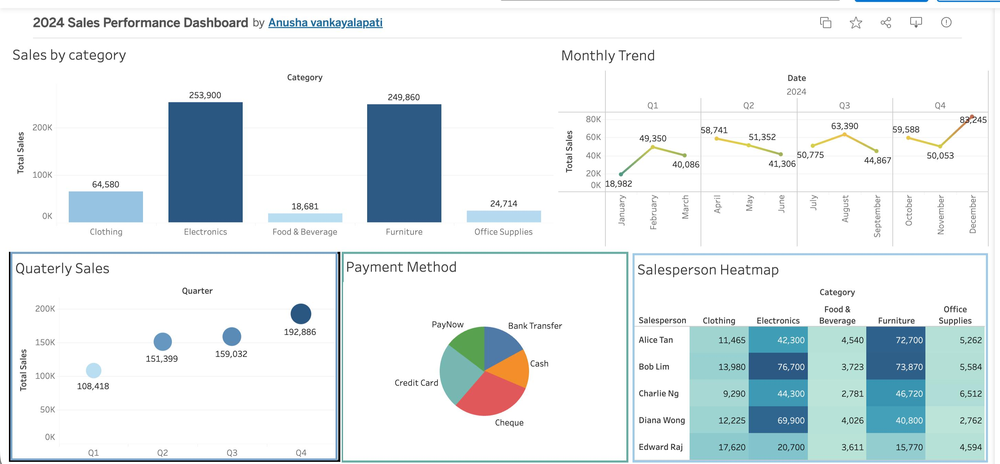

Tableau Sales Dashboard — 2024

An interactive sales performance dashboard built using 
Tableau Public and Excel.
Live Dashboard
 [Click here to view Live Dashboard](https://public.tableau.com/app/profile/anusha.vankayalapati/viz/2024SalesPerformanceDashboard/2024SalesPerformanceDashboard?publish=yes)

Dashboard Preview

What This Dashboard Shows

- Sales by Category — Bar Chart
-  Monthly Sales Trend — Line Chart  
-  Quarterly Sales — Bubble Chart
-  Payment Methods — Pie Chart
-  Salesperson Performance — Heatmap

-  Tools Used

| Tool | Purpose |
|------|---------|
| Tableau Public | Dashboard & Visualizations |
| Microsoft Excel | Data Source (300 rows) |

Files in This Repository

| File | Description |
|------|------------|
| sales_dashboard.png | Dashboard screenshot |
| Sales_Dashboard_Tableau.xlsx | Raw sales data |

Data Details

- 300 rows of sales data
- 5 Regions: North, South, East, West, Central
- 5 Categories: Electronics, Furniture, Office Supplies, Clothing, Food & Beverage
- 5 Salespersons: Alice Tan, Bob Lim, Charlie Ng, Diana Wong, Edward Raj
- Time Period: January 2024 — December 2024

- Built By

**Anusha Vankayalapati**
Business Analyst | Singapore

📧 anushavankayalapati98@gmail.com  
🔗 [LinkedIn](https://www.linkedin.com/in/vankayalapati-anusha/)

⭐ If you like this project please star the repository!

**Tools Used**

tableau
data-visualization
sales-dashboard
excel
business-analyst
power-bi
singapore
dashboard
